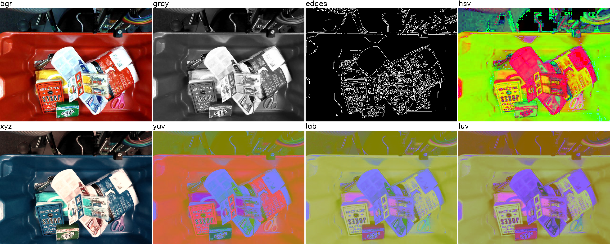

<h1 align="center">
  imgviz-cpp
</h1>

<h4 align="center">
  Image Visualization Tools for C++
</h4>

<div align="center">
  <a href="https://github.com/wkentaro/imgviz-cpp/actions">
    
  </a>
</div>

<div align="center">
  <a href="#installation"><b>Installation</b></a> |
  <a href="examples/getting_started.cpp"><b>Getting Started</b></a> |
  <a href="#examples"><b>Examples</b></a>
</div>

<br/>

<div align="center">
  
</div>

## Installation

1. Copy [`include/imgviz.hpp`](include/imgviz.hpp) to
  your project's `include` directory.
1. Add below to your `CMakeLists.txt`.
1. Refer to [`examples/getting_started.cpp`](examples/getting_started.cpp)
   and [examples](#examples) to see how to use this library.

```cmake
find_package(OpenCV REQUIRED)

include_directories(${OpenCV_INCLUDE_DIRS} include)
link_directories(${OpenCV_LIBRARY_DIRS})
add_definitions(${OpenCV_DEFINITIONS})

add_executable(your_executable src/your_executable.cpp)
target_link_libraries(your_executable ${OpenCV_LIBRARIES})
```

## Examples

```bash
git clone https://github.com/wkentaro/imgviz-cpp.git
cd imgviz-cpp

mkdir build
cd build

cmake ..
make -j

./getting_started ../data
```

<table>
  <tr>
    <td>
      <a href="examples/label_to_bgr.cpp">
        <code>examples/label_to_bgr.cpp</code>
      </a>
    </td>
    <td></td>
  </tr>
  <tr>
    <td>
      <a href="examples/depth_to_bgr.cpp">
        <code>examples/depth_to_bgr.cpp</code>
      </a>
    </td>
    <td></td>
  </tr>
  <tr>
    <td>
      <a href="examples/tile.cpp">
        <code>examples/tile.cpp</code>
      </a>
    </td>
    <td></td>
  </tr>
  <tr>
    <td>
      <a href="examples/centerize.cpp">
        <code>examples/centerize.cpp</code>
      </a>
    </td>
    <td></td>
  </tr>
</table>
