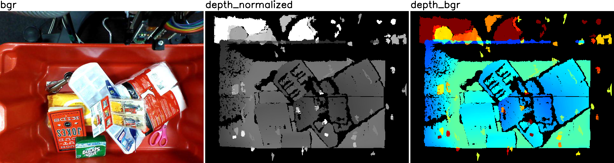

# imgviz-cpp

## Usage

1. Copy [`include/imgviz.hpp`](include/imgviz.hpp) to
  your project's `include` directory.
1. Add below to your `CMakeLists.txt`.

```cmake
find_package(OpenCV REQUIRED)

include_directories(${OpenCV_INCLUDE_DIRS} include)
link_directories(${OpenCV_LIBRARY_DIRS})
add_definitions(${OpenCV_DEFINITIONS})

add_executable(your_executable src/your_executable.cpp)
target_link_libraries(your_executable ${OpenCV_LIBRARIES})
```

## Examples

```bash
git clone https://github.com/wkentaro/imgviz-cpp.git
cd imgviz-cpp

mkdir build
cd build

cmake ..
make -j

./depth_to_bgr ../examples/data
```

<table>
  <tr>
    <td>
      <a href="examples/depth_to_bgr.cpp">
        <code>examples/depth_to_bgr.cpp</code>
      </a>
    </td>
    <td></td>
  </tr>
</table>
